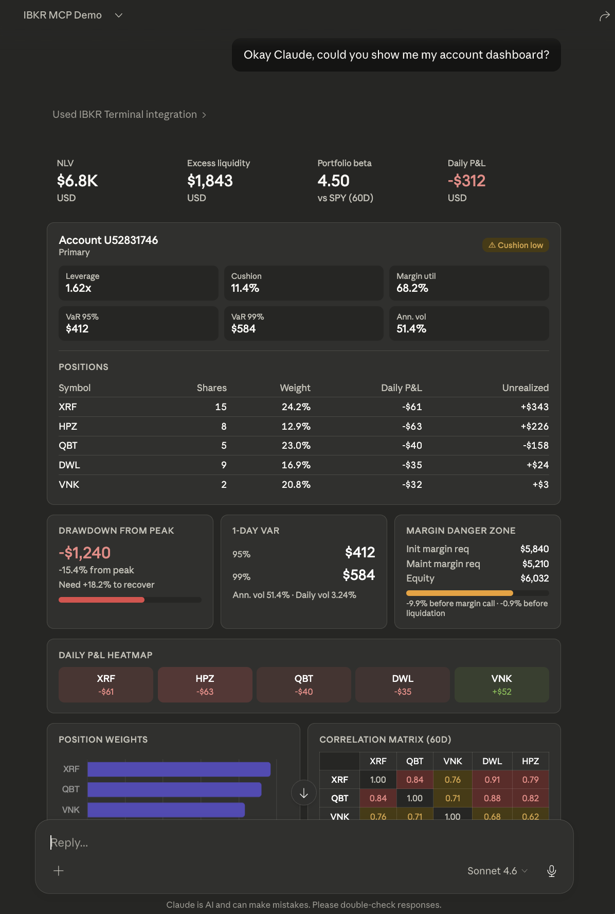
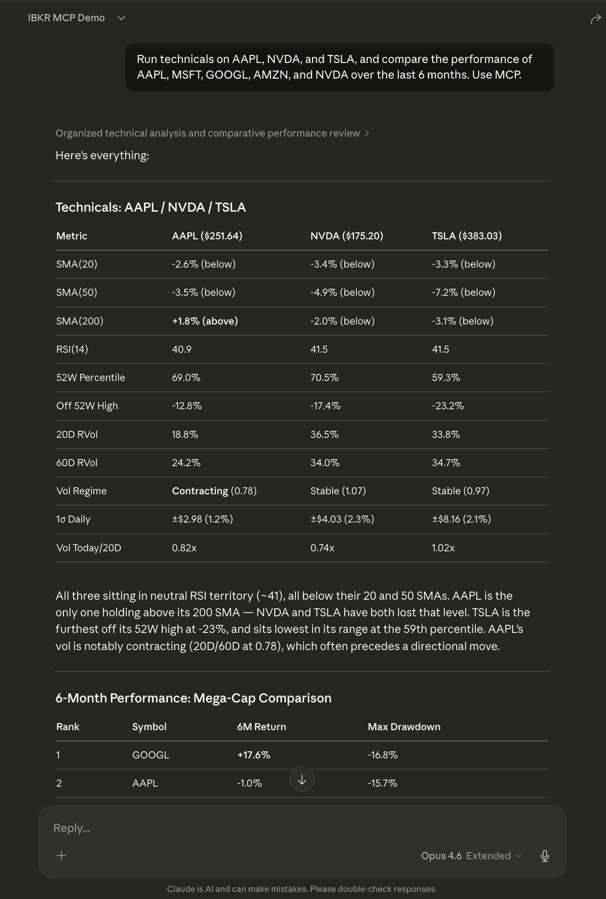
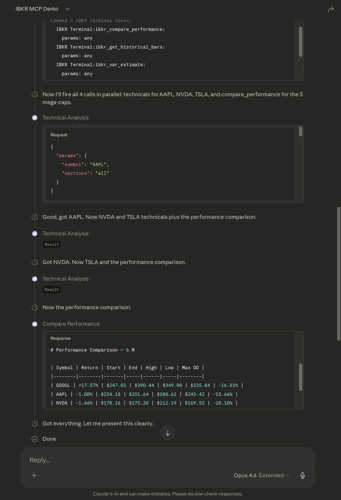
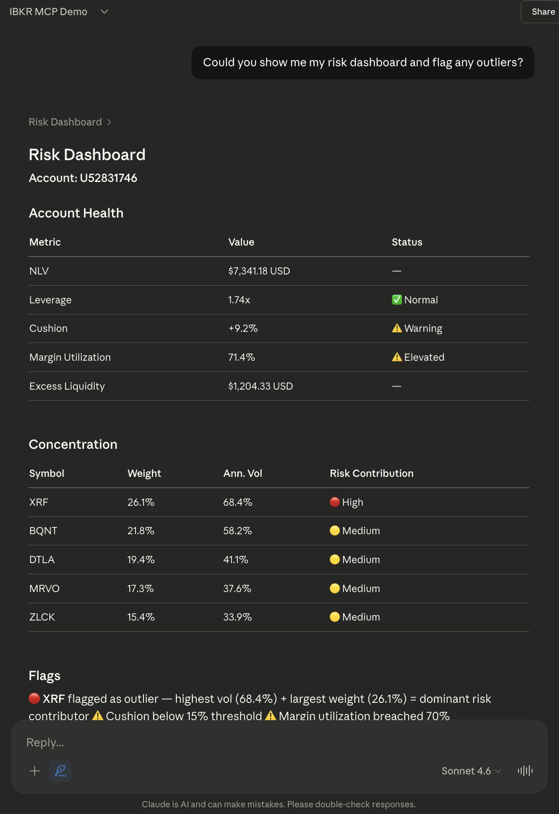

# ibkr-terminal — Interactive Brokers MCP Server

MCP server for Interactive Brokers. Real-time portfolio analytics, margin simulation, risk management, and market data — exposed as tools over the [Model Context Protocol](https://modelcontextprotocol.io).

<p align="center">

</p>

<p align="center"><em>Full account dashboard rendered as a claude.ai artifact — margin health, VaR, drawdown tracking, P&L heatmap, position weights, and correlation matrix from a single prompt.</em></p>

## What It Does

Ask your portfolio questions in natural language. The AI calls the right tools, chains them together, and returns analysis — not raw data.

- **Portfolio**: Positions, P&L, cost basis, concentration, multi-account consolidated view
- **Margin**: Real-time margin analysis, what-if simulation, per-symbol efficiency
- **Risk**: Stress testing with custom scenarios, correlation matrix, Value-at-Risk, drawdown tracking
- **Market Data**: Quotes, historical bars, options chains with Greeks, technicals (SMA/RSI/MACD/Bollinger)
- **Intelligence**: Currency exposure, sector decomposition, rebalance planning, beta analysis
- **Briefing**: One-prompt daily briefing with positions, P&L, margin, movers, and thesis conformance

32 tools across 9 modules. All read-only — no order placement.

## Demo

**[Live Dashboard Artifact](https://claude.site/public/artifacts/ee62368f-5175-4bc0-aea7-d4399ccaf7d4)** — Full portfolio dashboard generated from a single prompt on claude.ai.



*Technicals, sector exposure, and risk analysis from a single natural language prompt.*



*Chained tool calls across market data, portfolio, and intelligence modules.*



*Stress testing and margin analysis with automated scenario generation.*

## Setup

Requires IB Gateway or TWS running locally. See `env.example` for configuration.

```bash
python3 -m venv venv
source venv/bin/activate
pip install -r requirements.txt
cp env.example .env
# Edit .env with your IB Gateway settings
```

**Local (stdio — Claude Code):**
```bash
python server.py
```

**Remote (HTTP — claude.ai and other MCP clients):**
```bash
python server_http.py
```

## License

Proprietary. See [LICENSE](LICENSE).
